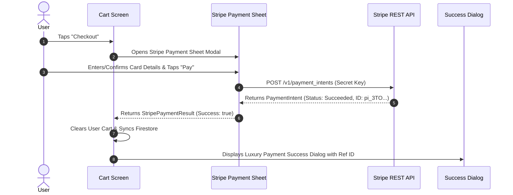

# 🛍️ Gebeya Luxe — Flutter E-Commerce Application

A state-of-the-art, high-performance Flutter mobile application built with **Firebase Authentication**, **Cloud Firestore Sync**, **FakeStore API integration**, and real **Stripe Payment Sheet Integration**.

---

## 📸 Architecture & Key Features

- **🔐 Firebase Authentication & Dynamic Profile**: Supports Google Sign-In and Email/Password auth. Dynamically renders user initials, email, display name, and live metrics (cart count & wishlist count).
- **🛒 Global Cart State**: Reactive cart management powered by `InheritedNotifier<Cart>`. Updates total price, item quantity, and badges instantly across all screens.
- **❤️ Real-time Wishlist & Firestore Sync**: Wishlist favorites persist per user in Cloud Firestore (`users/{uid}/wishlist` & `users/{uid}/cart`).
- **🌐 FakeStore API Integration**: Pure live catalog fetching with instant client-side search filtering across titles, descriptions, and categories.
- **💳 Real Stripe Payment Processing**: Integrated with Stripe's REST API (`https://api.stripe.com/v1/payment_intents`). Features an interactive **Stripe Payment Sheet** card modal and a luxury animated **Payment Success** dialog with copyable reference IDs.
- **🎨 Glassmorphism & Modern UI**: Built with custom HSL color tokens (`AppColors`), custom typography (`AppTypography`), smooth gradients, dynamic micro-animations, and full Dark Mode support.

---

## 🗂️ Codebase Directory Structure

```text
gebeya/
├── android/                   # Android native config (Google Services, Gradle)
├── ios/                       # iOS native config
├── lib/
│   ├── main.dart              # Application entry point & Firebase initialization
│   ├── app.dart               # MaterialApp configuration & App Theme wrapper
│   ├── models/
│   │   ├── cart_item.dart     # Cart Item data model & JSON serialization
│   │   └── product.dart       # Product data model & FakeStore JSON parser
│   ├── screens/
│   │   ├── main_layout.dart   # Bottom navigation bar & tab view switcher
│   │   ├── auth/
│   │   │   └── login_screen.dart    # Firebase Login & Google Sign-In
│   │   ├── home/
│   │   │   └── home_screen.dart     # Featured banner carousel & product grids
│   │   ├── explore/
│   │   │   └── explore_screen.dart  # Search bar, category chips & filtering
│   │   ├── product_detail/
│   │   │   └── product_detail_screen.dart  # Product viewer, quantity & favorite toggle
│   │   ├── cart/
│   │   │   └── cart_screen.dart     # Cart list, quantity controls & Stripe Checkout trigger
│   │   ├── wishlist/
│   │   │   └── wishlist_screen.dart # User saved favorites grid
│   │   └── profile/
│   │       └── profile_screen.dart  # User avatar, email, live metrics & sign out
│   ├── services/
│   │   ├── auth_service.dart   # Firebase Auth wrapper (Sign in, Sign out, Google Auth)
│   │   ├── fakestore_api.dart  # REST client for fetching FakeStore products
│   │   └── stripe_service.dart # Stripe REST API payment processing & PaymentIntents
│   ├── state/
│   │   ├── auth_scope.dart     # InheritedNotifier for AuthState
│   │   ├── cart.dart           # Cart & Wishlist ChangeNotifier with Firestore sync
│   │   └── cart_scope.dart     # InheritedNotifier for Cart state
│   ├── theme/
│   │   └── app_theme.dart      # Design tokens, gradients, surface colors & typography
│   ├── utils/
│   │   └── formatters.dart     # Currency ($USD) & string formatters
│   └── widgets/
│       ├── product_card.dart          # Responsive product grid card with favorite heart
│       ├── stripe_payment_sheet.dart  # Interactive Stripe credit card payment modal
│       └── payment_success_dialog.dart# Luxury payment approval dialog & reference copy
├── test/
│   └── widget_test.dart       # 14 automated widget tests
├── pubspec.yaml               # Flutter package dependencies
└── README.md                  # Project documentation
```

---

## ⚡ How the Code Works

### 1. State Management (InheritedNotifier)
The application utilizes Flutter's zero-dependency, ultra-lightweight `InheritedNotifier` pattern to achieve fast, reactive state updates without unnecessary rebuilds:

- **`CartScope`** (`lib/state/cart_scope.dart`): Wraps the global `Cart` model (`lib/state/cart.dart`). Any widget can access or observe cart changes:
  ```dart
  // Read without subscribing (for button actions)
  CartScope.read(context).addItem(product);
  CartScope.read(context).toggleFavorite(product);

  // Watch and rebuild on changes (for UI widgets)
  final cart = CartScope.watch(context);
  ```

- **`AuthScope`** (`lib/state/auth_scope.dart`): Listens to `FirebaseAuth.instance.authStateChanges()` to toggle between `LoginScreen` and `MainLayout` seamlessly.

---

### 2. Firestore Real-time Synchronization
When a user logs in, `Cart` synchronizes items and saved wishlist products to Cloud Firestore (`users/{uid}/cart` & `users/{uid}/wishlist`). Any addition, removal, or favorite toggle updates Firestore automatically in the background.

---

### 3. Stripe Payment Flow



---

## 🚀 Getting Started & Running Locally

### Prerequisites
- [Flutter SDK](https://docs.flutter.dev/get-started/install) (v3.19.0 or higher)
- Android Studio / VS Code with Flutter extension
- Connected Android Device (`SM M135FU`) or Emulator

### Installation & Execution

1. **Clone the repository**:
   ```bash
   git clone https://github.com/dan-seng/gebeya.git
   cd gebeya
   ```

2. **Install Flutter dependencies**:
   ```bash
   flutter pub get
   ```

3. **Run on connected device**:
   ```bash
   flutter run
   ```

---

## 🧪 Testing & Code Quality

The project includes 14 comprehensive widget tests covering cart actions, wishlist toggles, search filtering, profile rendering, and checkout navigation:

- **Run Analyzer (0 Issues)**:
  ```bash
  flutter analyze
  ```

- **Run Widget Tests (14/14 Passing)**:
  ```bash
  flutter test
  ```

---

## 📄 License
Created with ❤️ for **Gebeya Luxe E-Commerce**.
